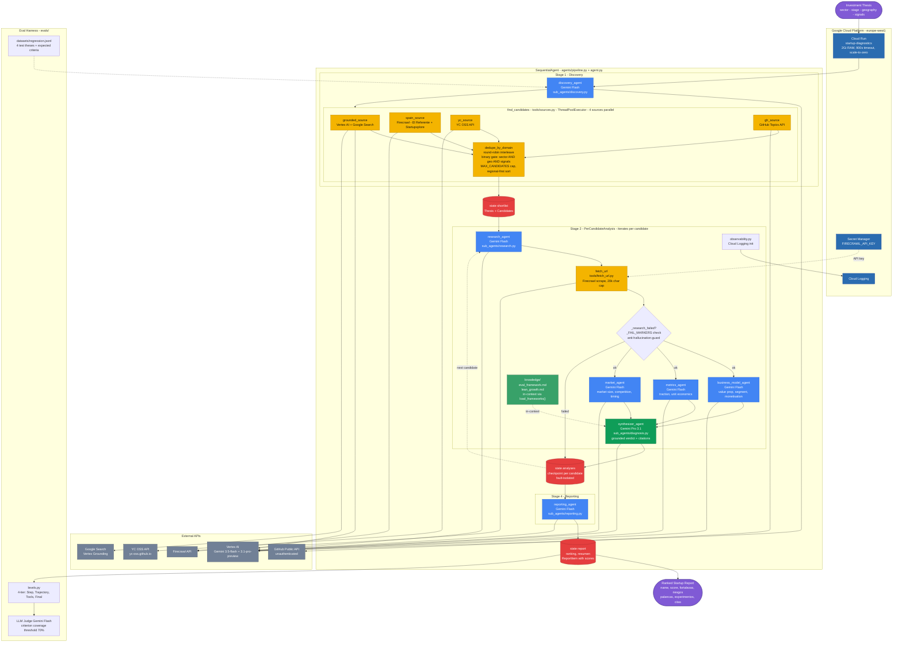

# Diagnóstico 360º de Startups — Pipeline multi-agente (Google ADK + Vertex AI)

> **Demo para Tales Venture.** Tales Venture (venture studio gallego) hace
> diagnóstico 360º de startups como servicio core. Esta demo **automatiza ese
> proceso de punta a punta**: dada una **tesis de inversión**, descubre
> candidatas en fuentes públicas, las analiza y entrega una **shortlist
> diagnosticada** con experimentos Lean priorizados — citando los frameworks de
> evaluación en cada conclusión.

**Input:** una tesis `{sector, stage, geografía, señales}`.
**Output:** shortlist diagnosticada (JSON + informe legible) con **citas de los
frameworks**, expuesta en una URL de Cloud Run.

🔗 **Demo en Cloud Run:** <https://startup-diagnostics-ktzjduvl6q-ew.a.run.app/dev-ui/>
_(scale-to-zero → el primer mensaje arranca en ~5-10 s; una corrida completa tarda minutos)._
Si redespliegas en otro proyecto, recupera la URL con
`gcloud run services describe startup-diagnostics --region=europe-west1 --format="value(status.url)"`.

---

## Estado por fases (v2 — pipeline de 4 etapas)

| Fase | Qué entrega | Estado |
|------|-------------|--------|
| **F1** | Scaffold + agente "hello-world" ADK sobre Vertex + **deploy a Cloud Run con URL** | ✅ hecho |
| **F2** | **Discovery**: agente de sourcing (YC OSS) → shortlist cualificada vs tesis (gate binario) | ✅ hecho |
| **F3** | **Analysis** (research/business/metrics/market) + **Diagnosis** (frameworks en contexto + citación) | ✅ hecho |
| **F4** | **Presentation** (informe rankeado) + 2ª fuente (GitHub) con dedupe por dominio | ✅ hecho |
| **F5** | Harness de evals (4 niveles + LLM-judge) + dataset de regresión + docs | ✅ hecho |

> El `ResearchAgent` + tool `fetch_url` son un **componente de Analysis (F3)**,
> no una fase aparte: dentro del pipeline leen la candidata de `state` y escriben
> su resumen en `state["research"]`.
> Filosofía: **mínimo que funcione, desplegado pronto**. Una URL que funciona >
> la perfección.

---

## Arquitectura — pipeline de 4 etapas



- **Discovery**: consulta 4 fuentes **en paralelo** — grounding con Google
  Search (Vertex), prensa/directorios de startups españoles (Firecrawl), YC OSS
  y GitHub —, normaliza, **deduplica por dominio** (gana grounded → spain → YC)
  y aplica un **gate binario** (`es_candidato`/`no_es_candidato`) a cada
  candidata contra la tesis. Respeta `robots.txt`/ToS, GDPR-aware; **no**
  scrapea LinkedIn/Crunchbase ni reconstruye una base tipo Harmonic.
- **Analysis**: un agente custom (`PerCandidateAnalysis`) itera las cualificadas
  (hasta `MAX_CANDIDATES`); por
  cada candidata corre `research` y luego los 3 analistas (business/metrics/
  market) **en paralelo** (research primero porque los analistas leen `{research}`).
- **Diagnosis**: `gemini-3.1-pro-preview`, **grounded en los frameworks en contexto**,
  citando de qué framework sale cada conclusión.
- **Presentation**: informe rankeado (JSON + legible).
- Detalle en [docs/architecture.md](docs/architecture.md).

---

## Conocimiento = frameworks EN CONTEXTO (no RAG)

Decisión cerrada: el corpus de frameworks es pequeño y estático → se leen de
`knowledge/*.md` y se **inyectan en el `instruction`** de los agentes de Diagnosis
(y Analysis si aplica). **Sin** vector DB, embeddings, Vertex AI Search ni Skills.
Si el corpus crece en el futuro → migrar a Vertex AI Search (fuera de esta demo).

**Auditabilidad por prompting:** el agente cita el framework de cada conclusión
(p. ej. *"según el criterio Mercado del Marco de evaluación…"*).

---

## Estructura del repo

```
startups-agents-gcp/
├── agents/                  # paquete ADK desplegable (el "app")
│   ├── agent.py             # root_agent = build_pipeline()
│   ├── pipeline.py          # SequentialAgent + PerCandidateAnalysis (BaseAgent custom)
│   ├── config.py            # Settings: routing Vertex, modelos, MAX_CANDIDATES, keys
│   ├── prompts.py           # instrucciones de cada agente
│   ├── schemas.py           # pydantic: Thesis · Candidate · Shortlist · Report
│   ├── knowledge.py         # loader: knowledge/*.md → str para el instruction
│   ├── requirements.txt     # ⚠️ deps del contenedor Cloud Run (NO el pyproject)
│   ├── sub_agents/          # discovery · research · business_model · metrics · market · diagnosis · reporting
│   └── tools/               # fetch_url · yc_source · gh_source · sources (find_candidates + dedupe)
├── knowledge/               # frameworks .md inyectados en contexto (no RAG)
│   ├── evaluation_framework.md
│   └── lean_growth.md
├── evals/                   # F5: harness de 4 niveles · `python -m evals.run`
│   ├── levels.py            # lógica de los 4 niveles (pura, testeable)
│   ├── run.py               # captura una corrida + LLM-judge (Vertex)
│   └── datasets/            # regression.jsonl (4 tesis + criterios esperados)
├── tests/                   # pytest (unit + wiring)
├── docs/architecture.md     # detalle técnico + decisiones
├── .env.example
└── pyproject.toml
```

---

## Puesta en marcha (local)

Requisitos: Python 3.13, [uv](https://docs.astral.sh/uv/), `gcloud` con ADC
(`gcloud auth application-default login`) sobre tu proyecto de GCP.

```bash
uv sync
cp .env.example .env          # rellena las keys (Vertex no necesita; las fuentes sí)

# ⚠️ Windows Application Control (WDAC) bloquea los .exe de .venv\Scripts
# (adk.exe, pytest.exe). Invoca SIEMPRE como módulo de Python:
uv run python -m pytest -q
uv run python -m google.adk.cli web agents      # UI local en http://localhost:8000
```

## Despliegue (Cloud Run)

```bash
# Exporta el proyecto y la key, y usa el script (preflight + tests + Secret Manager):
export GOOGLE_CLOUD_PROJECT=tu-proyecto-gcp
export FIRECRAWL_API_KEY=fc-...
pwsh ./scripts/deploy.ps1

# Equivalente manual (la key va por Secret Manager, no en texto plano):
uv run python -m google.adk.cli deploy cloud_run \
  --project=$GOOGLE_CLOUD_PROJECT --region=europe-west1 \
  --service_name=startup-diagnostics --with_ui agents \
  -- --allow-unauthenticated --memory=2Gi --timeout=900 \
     --update-env-vars=GOOGLE_CLOUD_PROJECT=$GOOGLE_CLOUD_PROJECT,GOOGLE_CLOUD_LOCATION=global \
     --set-secrets=FIRECRAWL_API_KEY=firecrawl-api-key:latest
```

- ⚠️ **Las dependencias del contenedor salen de `agents/requirements.txt`**, NO
  del `pyproject.toml`. Si un paquete que importa el agente no está ahí, el
  contenedor arranca pero `/run` devuelve 500 (`ModuleNotFoundError`).
- ⚠️ **`--memory=2Gi` y `--timeout=900` son obligatorios.** Con los 512Mi por
  defecto, una corrida completa (varias candidatas, analistas en paralelo) **se
  queda sin memoria (OOM)** y el contenedor corta la conexión a mitad; los 300s
  por defecto se quedan cortos para el pipeline síncrono (una candidata cuesta
  ~70s; `MAX_CANDIDATES=5` por defecto).
- **Scale-to-zero** por defecto. `--with_ui` = URL clicable. `--allow-unauthenticated`
  = pública (demo). Región `europe-west1` (EU/GDPR).
  ⚠️ Pública sin auth: cualquiera puede lanzar el pipeline (consume crédito) y, en
  una instancia caliente, leer sesiones de otros vía la API de ADK. Aceptable solo
  para una demo desechable — **borra el servicio tras el evento**
  (`gcloud run services delete startup-diagnostics --region=europe-west1`).
- La `FIRECRAWL_API_KEY` se guarda en **Secret Manager** y el servicio la lee con
  `--set-secrets` (nunca como env var en texto plano ni en el repo).

---

## Harness de evals (el diferenciador) — F5

Calidad **medible** en 4 niveles (una corrida del pipeline, evaluada 4 veces):
1. **Paso individual** — ¿cada etapa produjo salida no vacía, sin errores?
2. **Trayectoria** — discovery → research → analistas → synthesizer → reporting.
3. **Llamada a herramientas** — `find_candidates` se llamó; y la URL de `fetch_url`
   **viene de una candidata en `state`** (no hardcodeada) → valida el flujo F3.
4. **Salida final** — el informe **cita frameworks reales** (de `knowledge/`) y
   cubre los criterios esperados (**LLM-as-judge** sobre Vertex).

Más un **dataset de regresión** (`evals/datasets/regression.jsonl`: 4 tesis con
criterios esperados) y `python -m evals.run` → informe por nivel + fallos
concretos (`--all` para todo el dataset).

```bash
uv run python -m evals.run          # primera tesis
uv run python -m evals.run --all    # dataset completo (más lento / más crédito)
```

---

## Guion de demo (2 min)

1. **(15s)** "Tales Venture diagnostica startups 360º a mano. Esto lo automatiza
   end-to-end: de una tesis a una shortlist diagnosticada."
2. **(20s)** Abrir la URL → introducir la tesis de ejemplo.
3. **(40s)** Ver el pipeline: Discovery (sourcing) → Analysis (en paralelo) →
   Diagnosis (grounded en frameworks) → Presentation (informe rankeado).
4. **(25s)** Mostrar el informe del top 3 **con citas de frameworks** y experimentos Lean.
5. **(20s)** Enseñar el harness de evals: "no es humo, es medible — 4 niveles + dataset de regresión."

---

## Notas de proyecto

- **El sistema es para Tales Venture**: la tesis, las fuentes y los frameworks son
  *inputs configurables del cliente*, no asunciones. Preguntas de descubrimiento y
  dónde enchufa cada respuesta: [docs/preguntas-tales-venture.md](docs/preguntas-tales-venture.md).
- Prototipo sobre el proyecto GCP **personal** del autor. Si avanza a startup real,
  la producción se mueve a la cuenta cloud de esa startup.
- Región EU por GDPR; Discovery respeta robots.txt/ToS y es consciente de datos de founders.
- Código custom, type hints, funciones pequeñas, errores explícitos, secretos en `.env`.
