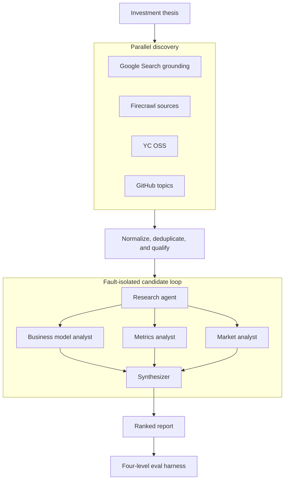

# Agentic Startup Diagnostics

A reliability-focused multi-agent pipeline built with Google ADK, Vertex AI, and typed Python state.
It turns an investment thesis into an evidence-backed startup shortlist, runs parallel analysis for each candidate, and produces a diagnosis grounded in versioned evaluation frameworks.

The repository is a reference implementation and does not advertise a live hosted demo.
Cloud Run packaging remains available for reproducible deployment.

## Engineering focus

- Explicit context injection from versioned Markdown instead of an unnecessary vector database.
- Parallel discovery and analysis with typed state between stages.
- Per-candidate fault isolation so one transient model failure cannot cancel the full run.
- Bounded candidate counts, timeouts, and source-specific limits to control latency and cost.
- A four-level evaluation harness covering steps, trajectory, tool calls, and final output.
- A regression dataset and LLM judge for repeatable quality checks.
- Structured observability that becomes a no-op outside Cloud Run.

## System flow



Discovery runs multiple sources concurrently and normalizes results into typed candidate records.
The custom per-candidate loop performs research first, then runs three analysts in parallel because every analyst depends on the same research state.
The synthesizer combines those outputs with the evaluation frameworks loaded into context.
The reporting agent ranks the accumulated diagnoses and produces the final result.

See [docs/architecture.md](docs/architecture.md) for the detailed state flow and operational tradeoffs.

## Context architecture

The framework corpus is small, static, and versioned under `knowledge/`.
The loader reads those files and injects them into the relevant agent instructions.

This choice keeps the context inspectable and removes the cost and operational surface of embeddings, a vector database, and a retrieval service.
The agents must cite the framework behind each conclusion, which makes the reasoning easier to audit.

If the corpus becomes large or changes frequently, the architecture documents identify managed retrieval as the migration point.
It is not part of this implementation.

## Reliability and recovery

The pipeline treats partial progress as useful state.
A failure while analysing one candidate is captured for that candidate and does not discard completed work for the rest of the shortlist.

The repository includes a regression for a production-like transient `429 RESOURCE_EXHAUSTED` failure.
The test verifies that a single candidate failure cannot collapse the whole task group.

Other safeguards include:

- Explicit maximum candidate counts.
- Source normalization and deduplication by domain.
- Timeouts around remote work.
- Checkpoint-friendly typed state between phases.
- Errors represented in results instead of hidden behind empty output.
- No-op telemetry outside the managed runtime.

## Evaluation harness

One captured run is evaluated at four levels:

1. Step evaluation verifies that each expected stage produced non-empty output without recorded errors.
2. Trajectory evaluation verifies the expected discovery, research, analysis, synthesis, and reporting sequence.
3. Tool evaluation verifies that discovery was called and that fetched URLs came from candidate state instead of hardcoded arguments.
4. Final-output evaluation checks framework grounding and expected criteria with an LLM judge.

The regression dataset lives at `evals/datasets/regression.jsonl`.
It contains four investment theses with expected criteria.

```bash
uv run python -m evals.run
uv run python -m evals.run --all
```

The live eval runner uses Vertex AI and configured sources, so it consumes external services.
The pure level logic is covered by offline tests.

## Repository layout

```text
agents/                  Google ADK application and typed pipeline state
agents/sub_agents/       Discovery, research, analyst, synthesis, and reporting agents
agents/tools/            Source and content tools
knowledge/               Versioned evaluation and Lean/Growth frameworks
evals/                   Capture, four-level evaluation, judge, and regression dataset
tests/                   Offline unit, wiring, state, and failure-isolation tests
docs/architecture.md     Architecture decisions and operational limits
scripts/deploy.ps1       Cloud Run preflight and deployment script
```

## Local development

Requirements are Python 3.13, [uv](https://docs.astral.sh/uv/), and Google Cloud Application Default Credentials for live Vertex AI calls.

```bash
uv sync
cp .env.example .env
uv run python -m pytest -q
uv run python -m google.adk.cli web agents
```

The offline suite does not require Vertex AI or source API keys.
The current baseline is 76 passing tests.

## Cloud Run packaging

The repository includes deployment configuration for Cloud Run in `europe-west1` with scale-to-zero, explicit memory, and an extended request timeout.
The Firecrawl secret is expected through Secret Manager rather than plaintext environment configuration.

```bash
export GOOGLE_CLOUD_PROJECT=your-project-id
pwsh ./scripts/deploy.ps1
```

No public service URL is maintained from this repository.
Unauthenticated deployment is suitable only for a disposable demonstration because a caller can consume model credit and inspect shared runtime sessions.
A real product should add authentication, tenant isolation, asynchronous jobs, and per-user quotas.

## Known limits

- The pipeline is synchronous and is not intended for large candidate sets.
- Live discovery is non-deterministic, so exact tool trajectories are unsuitable as the only regression signal.
- The custom final-output judge does not replace a full grounding or hallucination evaluator.
- A production version should add replay fixtures, stronger rubric evaluation, asynchronous execution, and durable managed state.
- The source adapters depend on external APIs and must surface coverage degradation when those APIs change.

These constraints are documented because they define the boundary between a strong reference implementation and a production agent platform.
