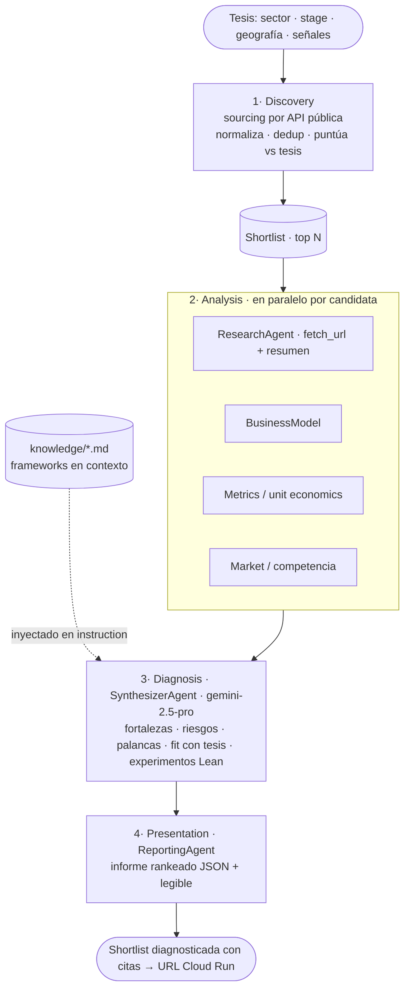

# Diagnóstico 360º de Startups — Pipeline multi-agente (Google ADK + Vertex AI)

> **Demo para Tales Venture.** Tales Venture (venture studio gallego) hace
> diagnóstico 360º de startups como servicio core. Esta demo **automatiza ese
> proceso de punta a punta**: dada una **tesis de inversión**, descubre
> candidatas en fuentes públicas, las analiza y entrega una **shortlist
> diagnosticada** con experimentos Lean priorizados — citando los frameworks de
> evaluación en cada conclusión.

**Input:** una tesis `{sector, stage, geografía, señales}`.
**Output:** shortlist diagnosticada (JSON + informe legible) con **citas de los
frameworks**, expuesta en una URL de Cloud Run.

🔗 **Demo desplegada (Cloud Run):** https://startup-diagnostics-PROJECT_NUMBER.europe-west1.run.app/dev-ui/
_(se actualiza con cada fase; scale-to-zero → el primer mensaje arranca en ~5-10 s)_

---

## Estado por fases (v2 — pipeline de 4 etapas)

| Fase | Qué entrega | Estado |
|------|-------------|--------|
| **F1** | Scaffold + agente "hello-world" ADK sobre Vertex + **deploy a Cloud Run con URL** | ✅ hecho |
| **F2** | **Discovery**: agente de sourcing con 1 fuente API gratis → shortlist cruda | 🟢 siguiente |
| **F3** | **Analysis** (research/business/metrics/market) + **Diagnosis** (frameworks en contexto + citación) | ⚪ pendiente |
| **F4** | **Presentation** (informe rankeado) + 2ª fuente en Discovery | ⚪ pendiente |
| **F5** | Harness de evals (4 niveles) + README + guion de demo 2 min | ⚪ pendiente |

> El `ResearchAgent` + tool `fetch_url` (ya construidos) son un **componente de
> Analysis (F3)**, no una fase aparte.
> Filosofía: **mínimo que funcione, desplegado pronto**. Una URL que funciona >
> la perfección.

---

## Arquitectura — pipeline de 4 etapas



- **Discovery**: consulta 1-2 fuentes públicas gratis vía API, normaliza, deduplica
  y puntúa candidatas contra la tesis. Respeta `robots.txt`/ToS, GDPR-aware; **no**
  scrapea LinkedIn/Crunchbase ni reconstruye una base tipo Harmonic.
- **Analysis**: por cada candidata del top, agentes en paralelo (research,
  modelo de negocio, métricas, mercado).
- **Diagnosis**: `gemini-2.5-pro`, **grounded en los frameworks en contexto**,
  citando de qué framework sale cada conclusión.
- **Presentation**: informe rankeado (JSON + legible).
- Detalle en [docs/architecture.md](docs/architecture.md).

---

## Conocimiento = frameworks EN CONTEXTO (no RAG)

Decisión cerrada: el corpus de frameworks es pequeño y estático → se leen de
`knowledge/*.md` y se **inyectan en el `instruction`** de los agentes de Diagnosis
(y Analysis si aplica). **Sin** vector DB, embeddings, Vertex AI Search ni Skills.
Si el corpus crece en el futuro → migrar a Vertex AI Search (fuera de esta demo).

**Auditabilidad por prompting:** el agente cita el framework de cada conclusión
(p. ej. *"según el criterio Mercado del Marco de evaluación…"*).

---

## Reglas de Google Cloud

Demo sobre el proyecto `your-gcp-project`. Consume **solo el crédito
Marketing** (Discovery Engine queda sin usar en esta demo):

| Crédito | Importe | Caduca | Lo consume | En esta demo |
|---|---|---|---|---|
| **Marketing AI Agents Challenge** | 433,58 € | **2026-06-25** | Vertex AI · Cloud Run · Cloud Storage | ✅ sí |
| GenAI App Builder (trial) | 848,21 € | 2027-03-18 | Discovery Engine | ❌ no (no RAG) |

| Tarea | API / endpoint | Cómo |
|---|---|---|
| Llamadas a Gemini / agentes | `aiplatform.googleapis.com` | `GOOGLE_GENAI_USE_VERTEXAI=True` + ADK `LlmAgent` |
| Despliegue | `run.googleapis.com` | `adk deploy cloud_run` (scale-to-zero) |

❌ **Nunca** `import google.generativeai` ni `GOOGLE_API_KEY` (free-tier, no consume
el crédito). ❌ Nada de LangChain/LlamaIndex/OpenAI como transporte. ❌ Ni Cloud
Functions ni App Engine. ❌ No crear proyecto nuevo.

---

## Estructura del repo

```
startups-agents-gcp/
├── agents/                  # paquete ADK desplegable (el "app")
│   ├── agent.py             # root_agent (crece hasta el pipeline de 4 etapas)
│   ├── config.py            # Settings: routing Vertex, modelos, keys de fuentes
│   ├── prompts.py           # instrucciones de cada agente
│   ├── knowledge.py         # (F3) loader: knowledge/*.md → str para el instruction
│   ├── requirements.txt     # ⚠️ deps del contenedor Cloud Run (NO el pyproject)
│   ├── sub_agents/          # discovery · research · business_model · metrics · market · diagnosis · reporting
│   └── tools/               # fetch_url (Analysis) · tool de la fuente de Discovery (F2)
├── knowledge/               # frameworks .md inyectados en contexto (no RAG)
│   ├── evaluation_framework.md
│   └── lean_growth.md
├── evals/                   # F5: harness de 4 niveles · `python -m evals.run`
│   └── datasets/            # dataset de regresión (3-5 startups conocidas)
├── tests/                   # pytest (unit)
├── docs/architecture.md     # detalle técnico + decisiones
├── .env.example
└── pyproject.toml
```

---

## Puesta en marcha (local)

Requisitos: Python 3.13, [uv](https://docs.astral.sh/uv/), `gcloud` con ADC
(`gcloud auth application-default login`) sobre `your-gcp-project`.

```bash
uv sync
cp .env.example .env          # rellena las keys (Vertex no necesita; las fuentes sí)

# ⚠️ Windows Application Control (WDAC) bloquea los .exe de .venv\Scripts
# (adk.exe, pytest.exe). Invoca SIEMPRE como módulo de Python:
uv run python -m pytest -q
uv run python -m google.adk.cli web agents      # UI local en http://localhost:8000
```

## Despliegue (Cloud Run)

```bash
uv run python -m google.adk.cli deploy cloud_run \
  --project=your-gcp-project --region=europe-west1 \
  --service_name=startup-diagnostics --with_ui agents \
  -- --allow-unauthenticated --update-env-vars=FIRECRAWL_API_KEY=...
```

- ⚠️ **Las dependencias del contenedor salen de `agents/requirements.txt`**, NO
  del `pyproject.toml`. Si un paquete que importa el agente no está ahí, el
  contenedor arranca pero `/run` devuelve 500 (`ModuleNotFoundError`).
- **Scale-to-zero** por defecto. `--with_ui` = URL clicable. `--allow-unauthenticated`
  = pública (demo). Región `europe-west1` (EU/GDPR).
- Las keys de fuentes externas se pasan con `--update-env-vars` (o Secret Manager
  en producción).

---

## Harness de evals (el diferenciador) — F5

Calidad **medible** en 4 niveles:
1. **Paso individual** — ¿cada agente hace bien su parte?
2. **Trayectoria** — ¿la secuencia de decisiones es correcta de principio a fin?
3. **Llamada a herramientas** — ¿tool correcta, argumentos correctos?
4. **Salida final** — ¿el diagnóstico es correcto y cita fuentes reales?

Más un **dataset de regresión** (3-5 startups conocidas con criterios esperados) y
`python -m evals.run` → informe con métricas por nivel y fallos concretos.

---

## Guion de demo (2 min)

1. **(15s)** "Tales Venture diagnostica startups 360º a mano. Esto lo automatiza
   end-to-end: de una tesis a una shortlist diagnosticada."
2. **(20s)** Abrir la URL → introducir la tesis de ejemplo.
3. **(40s)** Ver el pipeline: Discovery (sourcing) → Analysis (en paralelo) →
   Diagnosis (grounded en frameworks) → Presentation (informe rankeado).
4. **(25s)** Mostrar el informe del top 3 **con citas de frameworks** y experimentos Lean.
5. **(20s)** Enseñar el harness de evals: "no es humo, es medible — 4 niveles + dataset de regresión."

---

## Notas de proyecto

- **El sistema es para Tales Venture**: la tesis, las fuentes y los frameworks son
  *inputs configurables del cliente*, no asunciones. Preguntas de descubrimiento y
  dónde enchufa cada respuesta: [docs/preguntas-tales-venture.md](docs/preguntas-tales-venture.md).
- Prototipo sobre el proyecto GCP **personal** del autor. Si avanza a startup real,
  la producción se mueve a la cuenta cloud de esa startup.
- Región EU por GDPR; Discovery respeta robots.txt/ToS y es consciente de datos de founders.
- Código custom, type hints, funciones pequeñas, errores explícitos, secretos en `.env`.
