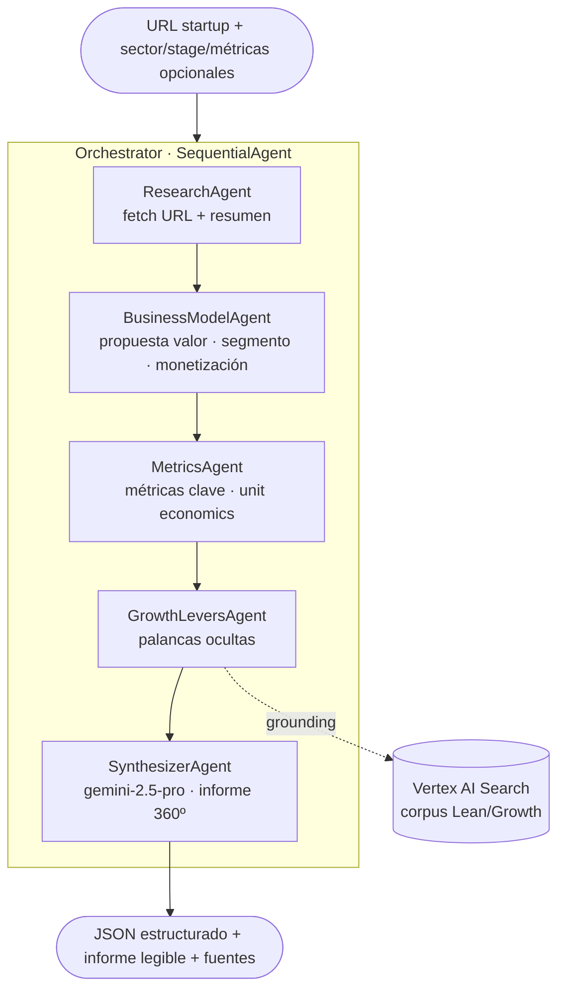

# Diagnóstico 360º de Startups — Agente multi-agente (Google ADK + Vertex AI)

> **Demo para Tales Venture.** Tales Venture (venture studio gallego) ofrece como
> servicio core el **diagnóstico 360º de startups** —modelo de negocio, métricas
> clave, palancas de crecimiento ocultas, metodología Lean Startup—. Esta demo
> **automatiza un trozo de ese mismo servicio**: la sorpresa es demostrar que se
> puede *10x* su propio proceso con un sistema de agentes sobre Google Cloud.

Dada la **URL de una startup** (+ datos opcionales), el sistema produce un
**diagnóstico 360º estructurado**: modelo de negocio, lectura de métricas,
palancas de crecimiento ocultas y experimentos Lean priorizados — con **fuentes
citadas** y un **harness de evals** que mide la calidad del diagnóstico.

🔗 **Demo desplegada (Cloud Run):** https://startup-diagnostics-PROJECT_NUMBER.europe-west1.run.app/dev-ui/ — chat en vivo (scale-to-zero; el primer mensaje arranca en ~5-10 s).

---

## Estado por fases

| Fase | Qué entrega | Estado |
|------|-------------|--------|
| **F1** | Scaffold + agente "hello-world" ADK sobre Vertex + **deploy a Cloud Run con URL** | 🟢 en curso |
| **F2** | `ResearchAgent` + tool de fetch de URL → resumen de la startup | ⚪ pendiente |
| **F3** | Diagnóstico multi-agente completo (business / metrics / growth / synth) | ⚪ pendiente |
| **F4** | Grounding RAG vía Vertex AI Search (Discovery Engine) | ⚪ pendiente |
| **F5** | Harness de evals (4 niveles) + UI mínima + guion de demo | ⚪ pendiente |

> Filosofía: **mínimo que funcione, desplegado pronto**. Una URL que funciona >
> la perfección. Primero validamos la tubería de despliegue (F1), luego metemos
> lógica.

---

## Arquitectura (objetivo)



- **Orquestación:** `SequentialAgent` de ADK encadena 5 sub-agentes.
- **LLM:** Gemini 2.5 **Flash** en los pasos baratos; **Pro** en la síntesis final.
- **RAG:** corpus de frameworks de growth/Lean indexado en Discovery Engine,
  consultado con `VertexAiSearchTool`.
- Detalle completo en [docs/architecture.md](docs/architecture.md).

---

## Reglas de Google Cloud (no negociable)

Esta cuenta tiene **dos créditos promocionales** ligados al proyecto
`your-gcp-project`. Cada decisión enruta el gasto al crédito correcto:

| Crédito | Importe | Caduca | Lo consume |
|---|---|---|---|
| **Marketing AI Agents Challenge** | 433,58 € | **2026-06-25** | Vertex AI · Cloud Run · Cloud Storage |
| GenAI App Builder (trial) | 848,21 € | 2027-03-18 | Discovery Engine (Vertex AI Search) |

| Tarea | API / endpoint | Cómo |
|---|---|---|
| Llamadas a Gemini / agentes | `aiplatform.googleapis.com` | `GOOGLE_GENAI_USE_VERTEXAI=True` + ADK `LlmAgent` |
| Despliegue | `run.googleapis.com` | `adk deploy cloud_run` (scale-to-zero) |
| Landing de documentos | `storage.googleapis.com` | bucket GCS |
| RAG / grounding | `discoveryengine.googleapis.com` | `VertexAiSearchTool` |

❌ **Nunca** `import google.generativeai` ni `GOOGLE_API_KEY` (eso es free-tier y
**no** consume el crédito). ❌ Nada de LangChain/LlamaIndex/OpenAI como transporte
de Gemini. ❌ Ni Cloud Functions ni App Engine (fuera del crédito). ❌ No crear
proyecto nuevo (los créditos no se transfieren).

---

## Estructura del repo

```
startups-agents-gcp/
├── agents/                  # paquete ADK desplegable (el "app")
│   ├── agent.py             # root_agent (F1 hello-world → Orchestrator en F3)
│   ├── config.py            # Settings: routing Vertex, modelos, región
│   ├── prompts.py           # instrucciones de cada agente
│   ├── sub_agents/          # F3: research · business_model · metrics · growth · synth
│   └── tools/               # F2: fetch_url · F4: vertex_search
├── evals/                   # F5: harness de 4 niveles  ·  `python -m evals.run`
│   └── datasets/            # dataset de regresión (3-5 startups conocidas)
├── rag/                     # F4: corpus + ingest a Discovery Engine
│   ├── corpus/              # Lean Startup, playbooks de growth, benchmarks
│   └── ingest.py
├── tests/                   # pytest (unit) — `test_smoke.py` valida el cableado
├── docs/architecture.md     # detalle técnico + decisiones de diseño
├── .env.example             # vars Vertex (sin secretos)
└── pyproject.toml
```

---

## Puesta en marcha (local)

Requisitos: Python 3.13, [uv](https://docs.astral.sh/uv/), `gcloud` autenticado
con ADC (`gcloud auth application-default login`) sobre `your-gcp-project`.

```bash
uv sync                       # instala dependencias
cp .env.example .env          # variables de Vertex (no son secretos)

# ⚠️ En esta máquina, Windows Application Control (WDAC) bloquea los .exe de
# .venv\Scripts (adk.exe, pytest.exe). Invoca SIEMPRE como módulo de Python:

uv run python -m pytest -q                       # tests
uv run python -m google.adk.cli web agents       # UI de chat local (http://localhost:8000)
uv run python -m google.adk.cli run agents       # REPL en terminal
```

## Despliegue (Cloud Run)

```bash
uv run python -m google.adk.cli deploy cloud_run \
  --project=your-gcp-project \
  --region=europe-west1 \
  --service_name=startup-diagnostics \
  --with_ui \
  agents \
  -- --allow-unauthenticated
```

- **Scale-to-zero** por defecto (no se fija `min-instances`) → no quema crédito en reposo.
- `--with_ui` despliega la interfaz de chat de ADK (URL clicable para la demo).
- `--allow-unauthenticated` → URL pública (es una demo; el endpoint es público).
- Región `europe-west1` (EU, consciente de GDPR).

---

## Harness de evals (el diferenciador) — F5

No es una demo de humo: la calidad es **medible** en 4 niveles.

1. **Paso individual** — ¿cada agente hace bien su parte?
2. **Trayectoria** — ¿la secuencia de decisiones es correcta de principio a fin?
3. **Llamada a herramientas** — ¿llama a la tool correcta con los argumentos correctos?
4. **Salida final** — ¿el diagnóstico es correcto y cita fuentes reales?

Más un **dataset de regresión** (3-5 startups conocidas con criterios esperados)
y un comando `python -m evals.run` que saca un informe con métricas por nivel y
los fallos concretos.

---

## Guion de demo (2 min)

1. **(15s)** "Tales Venture hace diagnóstico 360º de startups a mano. Esto
   automatiza ese proceso end-to-end sobre Google Cloud."
2. **(20s)** Abrir la URL de Cloud Run → pegar la URL de una startup conocida.
3. **(40s)** Ver el pipeline en acción: Research → BusinessModel → Metrics →
   GrowthLevers (grounded en frameworks Lean) → Synthesizer.
4. **(25s)** Mostrar el output: informe 360º estructurado **con fuentes citadas**.
5. **(20s)** Enseñar el harness de evals: "no me creáis a mí, miradlo medido —
   4 niveles de evaluación y un dataset de regresión."

> Estado actual (F1): la URL está viva y responde; el pipeline completo llega en F2-F5.

---

## Notas de proyecto

- Prototipo sobre el proyecto GCP **personal** del autor (`your-gcp-project`).
  Si avanza a startup real, la producción se mueve a la cuenta cloud de esa startup.
- Región EU por GDPR.
- Código custom, type hints, funciones pequeñas, manejo de errores explícito.
